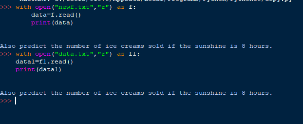

# copy-file
## AIM:

To write a python program for copying the contents from one file to another file. 
## EQUIPEMENT'S REQUIRED: 
PC
Anaconda - Python 3.7
## ALGORITHM: 
### Step 1:
open a existing file and give a file object

### Step 2: 
open it in read mode and store the contents of file in a variable
 
### Step 3: 
create a new file and open it in write mode

### Step 4:  
write the data stored in variable into this file
### Step 5: 
close the file


## PROGRAM:

```
with open("data.txt","r") as f:
    data=f.read()
with open("newf.txt","w") as f1:
    f1.write(data)
    
```

### OUTPUT:



## RESULT:
Thus the program is written to copy the contents from one file to another file.